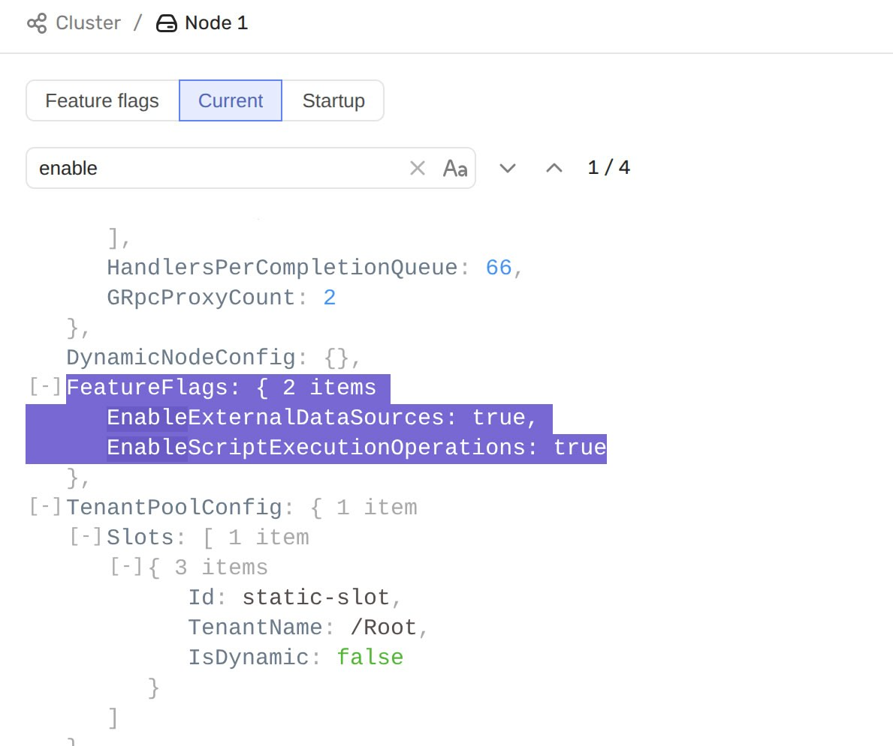
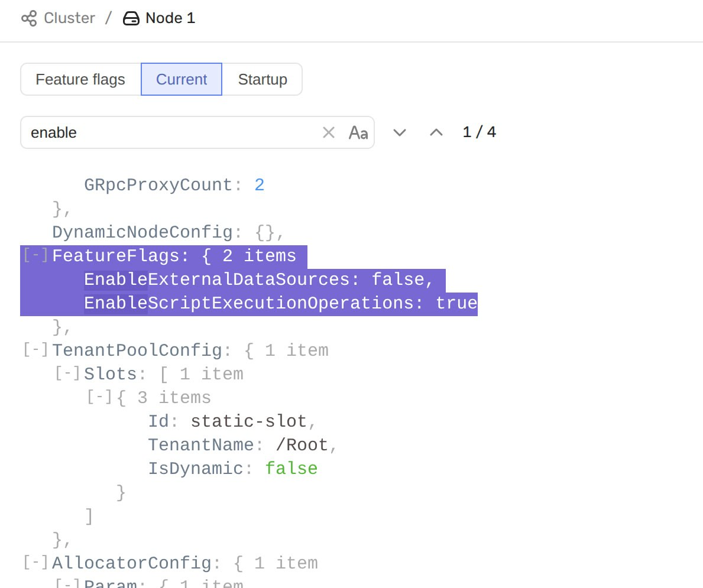

# Update YDB configuration

## Requirements

- preinstalled cluster with `3-nodes-mirror-3-dc` configuration
- current cluster configuration is stored in `3-nodes-mirror-3-dc/files/config.yaml`

## Steps

1. Update `3-nodes-mirror-3-dc/files/config.yaml` with the required configuration changes.
   Example: disable the enable_external_data_sources feature flag.
   ```yaml
   feature_flags:
      enable_external_data_sources: true  # change to false
      enable_script_execution_operations: true
   ```

   Before:
   

2. Apply the updated configuration to all nodes and restart the cluster with a rolling restart: `ansible-playbook ydb_platform.ydb.update_config`.

3. Check changes in the monitoring UI:

