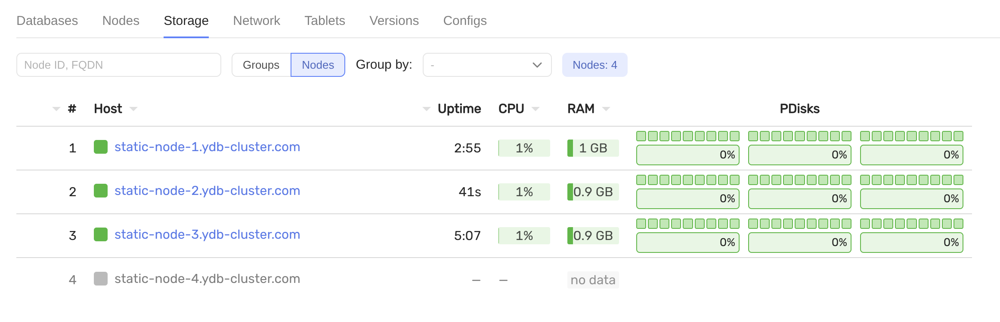
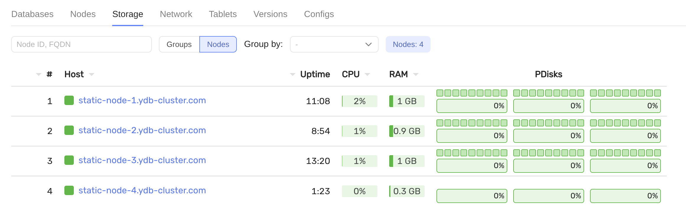
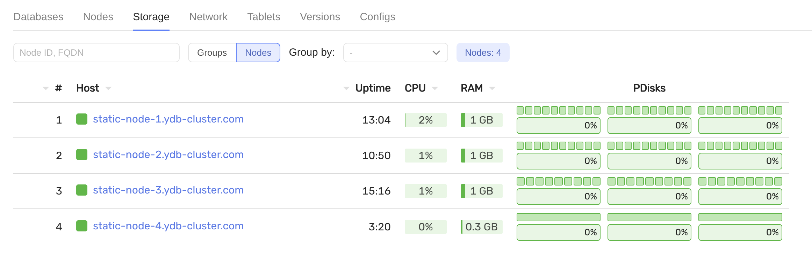

# Add new host (storage node)

## Requirements

- preinstalled cluster with `3-nodes-mirror-3-dc` configuration
- new server `static-node-4.ydb-cluster.com` with 3 disks (`/dev/vdb`, `/dev/vdc`, `/dev/vdd`)
- TLS certificate for `static-node-4.ydb-cluster.com` signed by the same CA as the existing cluster nodes, placed in `certs/static-node-4.ydb-cluster.com/`

## Steps

1. Update `files/config.yaml`: Add `static-node-4.ydb-cluster.com` to the `hosts` section with the appropriate `walle_location`
    ```yaml
    - host: static-node-4.ydb-cluster.com
    host_config_id: 1
    walle_location:
        body: 4
        data_center: 'zone-d'  # your zone
        rack: '4'
    ```

2. Push the updated config to all existing nodes and perform a rolling restart:
   ```bash
   ansible-playbook ydb_platform.ydb.update_config
   ```

3. Check that the new host has appeared in the monitoring UI:


4. Update `inventory/50-inventory.yaml` — add `static-node-4.ydb-cluster.com` to the `hosts` section.

5. Prepare the disks for YDB:
    ```bash
    ansible-playbook ydb_platform.ydb.prepare_drives -l static-node-4.ydb-cluster.com --extra-vars "ydb_disk_prepare=ydb_disk_1,ydb_disk_2,ydb_disk_3"
    ```

6. Prepare the host for YDB:
    ```bash
    ansible-playbook ydb_platform.ydb.prepare_host -l static-node-4.ydb-cluster.com -e "ydb_tools_install=false"
    ```

7. Update `files/config.yaml`: `storage_config_generation` should be incremented by 1

8. Install YDB on the new host and start the static node:
    ```bash
    ansible-playbook ydb_platform.ydb.install_static -l static-node-4.ydb-cluster.com --skip-tags password,bootstrap
    ```

9. Check that the new host is active in the monitoring UI:


10. Allow the cluster to use the new disks (blobstorage config update):
    ```bash
    ansible-playbook ydb_platform.ydb.update_config --extra-vars "ydb_storage_update_config=true" --tags storage --skip-tags restart
    ```

11. Add additional storage groups to a database:
    ```bash
    ansible-playbook ydb_platform.ydb.run_dstool --extra-vars 'cmd="group add --pool-name /Root/database:ssd --groups 1"'
    ```
    
