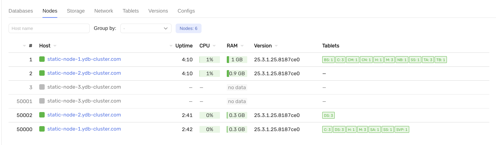
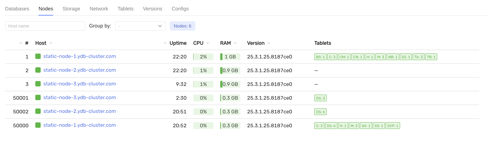

# Replace broken host

## Requirements

- preinstalled cluster with `3-nodes-mirror-3-dc` configuration
- broken host `static-node-3.ydb-cluster.com`
- new server with the same FQDN `static-node-3.ydb-cluster.com` with 3 disks (`/dev/vdb`, `/dev/vdc`, `/dev/vdd`)

## Steps

1. Verify the host is broken in the monitoring UI and remove it from the cluster if needed:


2. Prepare the disks for YDB on the new host:
    ```bash
    ansible-playbook ydb_platform.ydb.prepare_drives -l static-node-3.ydb-cluster.com --extra-vars "ydb_disk_prepare=ydb_disk_1,ydb_disk_2,ydb_disk_3"
    ```

3. Prepare the host for YDB:
    ```bash
    ansible-playbook ydb_platform.ydb.prepare_host -l static-node-3.ydb-cluster.com -e "ydb_tools_install=false"
    ```

4. Update `files/config.yaml`: `storage_config_generation` should be incremented by 1

5. Install YDB on the new host and start the static node:
    ```bash
    ansible-playbook ydb_platform.ydb.install_static -l static-node-3.ydb-cluster.com --skip-tags password,bootstrap
    ```
    Install and start the dynamic node if needed:
    ```bash
    ansible-playbook ydb_platform.ydb.install_dynamic --skip-tags password,create_database
    ```

6. Check that the host is active in the monitoring UI:

