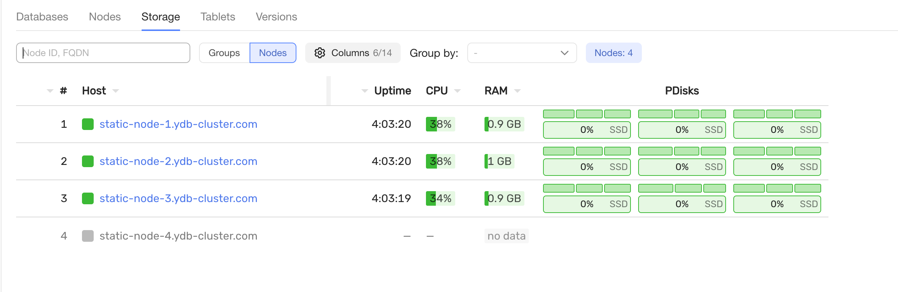
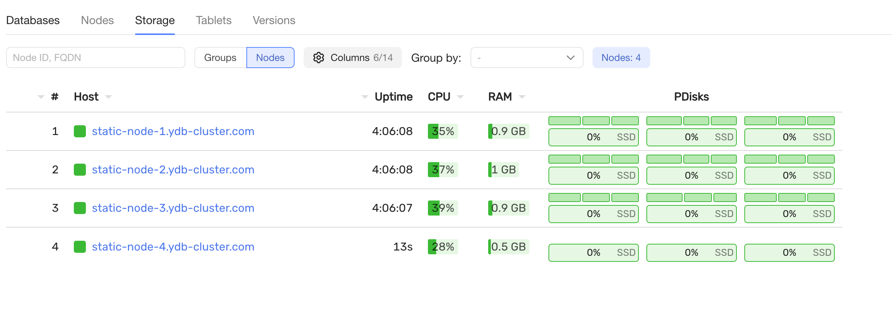

# Add new storage node

## Requirements

- preinstalled cluster with `3-nodes-mirror-3-dc-v2` configuration

## Steps
1. Update files/config.yaml and add new host into `config.hosts` section 
2. Update config in the YDB cluster.
```
ansible-playbook ydb_platform.ydb.update_config -l static-node-1.ydb-cluster.com
```
Server must appear in the Nodes pane.

3. Prepare the host for YDB.
```
ansible-playbook ydb_platform.ydb.prepare_host -l static-node-4.ydb-cluster.com
```

4. Install YDB on the host and start it 
```
ansible-playbook ydb_platform.ydb.install_static -l static-node-4.ydb-cluster.com --skip-tags password,bootstrap
```

5. Add additional storage groups to a database `ansible-playbook ydb_platform.ydb.run_dstool --extra-vars 'cmd="group add --pool-name /Root/db:ssd --groups 1"'`
